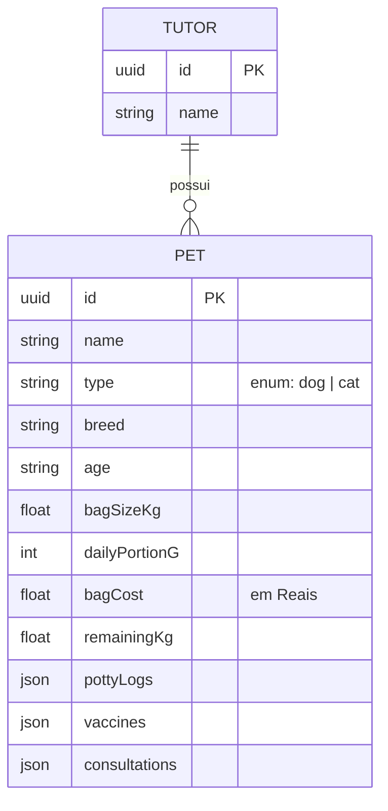

Aqui está o seu README atualizado! Substituí o projeto "Pé na Estrada" pelo **Lunnar Pet Health (LPH)**, ajustando os níveis dos títulos para manter a organização do perfil. Também aproveitei para atualizar a seção de **Tech Stack** com os ícones das novas tecnologias que você utilizou nesse projeto (React, TypeScript, NestJS e Node.js).

```markdown
<div align="center">
  
  
  <h1>Olá, eu sou o Jhonata Caetano 👋</h1>
  
  <p>
    <b>Desenvolvedor Full Stack | Analista de Sistemas</b>
  </p>

  <p>
    Transformando problemas complexos em soluções digitais robustas e escaláveis.
  </p>

 <a href="https://www.linkedin.com/in/jhonataclopes/">
  
</a>
  <a href="mailto:caetanojhonata@hotmail.com">
     
  </a>
</div>

<hr/>

### 🧐 Sobre mim

Minha missão é crescer como profissional de tecnologia, resolvendo problemas reais de forma estratégica. Tenho background em suporte corporativo e gerenciamento de banco de dados, e hoje atuo diretamente no desenvolvimento de software de ponta a ponta.

- 💼 **Experiência Atual:** Desenvolvedor FullStack Jr na **Álamo Benefícios**, trabalhando com automação, banco de dados (MySQL) e desenvolvimento web.
- 🔭 **Aprimoramento:** Aprofundando em **Arquitetura de Software e Full Stack** na mentoria START do @Luis Dev.
- 🎯 **Foco:** Entregar valor real aos negócios através de código limpo, APIs eficientes, arquiteturas modernas e interfaces premium.

---

### 💼 Experiência Profissional

**Álamo Benefícios**
- 👨‍💻 **Desenvolvedor FullStack Jr** *(Jun 2026 - Presente)*: Desenvolvimento e manutenção de soluções integradas, utilizando banco de dados e automações (MySQL, Google Apps Script).
- 🛠️ **Auxiliar de TI I** *(Dez 2025 - Jun 2026)*: Suporte ao gerenciamento de banco de dados corporativo via sistema SGA, garantindo integridade e disponibilidade de informações.

---

### 🐾 Projeto em Destaque: Lunnar Pet Health (LPH)

> Um ecossistema completo de monitoramento e prontuário inteligente para saúde de pets, desenvolvido com foco em alta manutenibilidade, design premium e práticas robustas de segurança. Este projeto foi construído sob padrões de engenharia de software de nível corporativo e serve como portfólio de referência para aplicações modernas Fullstack (React 19 + NestJS 11 + MySQL).

#### 📸 Visão Geral do Sistema
O **Lunnar Pet Health** permite que tutores e profissionais acompanhem a saúde diária de animais de estimação por meio de um painel de controle interativo. Ele resolve dores reais de monitoramento de rotina através de uma interface baseada em *Glassmorphic design* e uma API REST escalável e segura.

#### ⚡ Principais Funcionalidades

**Front-End (Web)**
* **Dashboard Modular e Personalizável**: Permite ao usuário escolher quais widgets deseja visualizar na tela principal (Calculadora de ração, Diário Fisiológico, Areia, Mimos, Vacinas, Consultas).
* **Calculadora de Consumo de Ração**: Estima automaticamente quantos dias o saco de ração atual durará, alertando o tutor e calculando o custo de alimentação diária por pet.
* **Diário Fisiológico com Regra de Qualidade**: Registro de necessidades com avaliação de qualidade, seguindo as recomendações de consistência veterinária.
* **Gerenciador de Consultas e Linha do Tempo**: Registros médicos com aba sanfonada e suporte a comentários aninhados na consulta.
* **Estilo Ultra Premium & Modo Escuro**: Design elegante baseado em tons quentes e suporte nativo a Tema Escuro com persistência local.

**Back-End (API)**
* **Persistência de Dados Relacional**: Integração completa via **TypeORM** com tabelas estruturadas e chaves estrangeiras com comportamento `CASCADE`.
* **Validação de Entrada Estrita (DTOs)**: Uso de `class-validator` e `class-transformer`. Campos não autorizados nas requisições HTTP são rejeitados antes de atingir o banco.
* **Prevenção contra XSS Armazenado**: Middleware interceptor global que sanitiza tags HTML e injeções de script recursivamente.
* **Segurança de Identificadores (Mitigação de IDOR)**: Uso de UUIDs de alta entropia, inviabilizando ataques de enumeração direta de recursos.

#### 📐 Modelo de Dados (DER Conceitual)



**Pré-requisitos:** Node.js (v18+) e MySQL / MariaDB rodando localmente.

**1. Clonar e Configurar o Banco**

```sql
CREATE DATABASE lunnar_pet_health;

```

**2. Configurar e rodar o Back-End (`prontuario-pet-api`)**

```bash
cd prontuario-pet-api
npm install

```

*Crie um arquivo `.env` na raiz do backend:*

```env
DB_HOST=localhost
DB_PORT=3306
DB_USERNAME=seu_usuario
DB_PASSWORD=sua_senha
DB_DATABASE=lunnar_pet_health

```

*Inicie o servidor:*

```bash
npm run start:dev

```

**3. Configurar e rodar o Front-End (`lunnar-pet-health-web`)**

```bash
cd lunnar-pet-health-web
npm install

```

*Crie o arquivo `.env` na raiz do frontend:*

```env
VITE_API_URL=http://localhost:3000

```

*Inicie o servidor:*

```bash
npm run dev

```

---

### 🛠️ Tech Stack

**Backend & Banco de Dados**


**Frontend & Ferramentas**


---

### 🎓 Formação Acadêmica

* 🎓 **Análise e Desenvolvimento de Sistemas** - Universidade Unigranrio (Fev 2024 - Dez 2026)
* 🔒 **Segurança da Informação e LGPD** - FAETEC (Mai 2026 - Out 2026)

---

### 📜 Principais Certificações

**Next Wave Education**

* 🏆 Desenvolvimento Web com ASP.NET MVC
* 🏆 Certificação em REST APIs com ASP.NET Core
* 🏅 C# e Programação Orientada a Objetos *(Foco em LINQ, Depuração e Manipulação de dados)*

**Universidade Estácio de Sá**

* 🏅 Programação de Algoritmos Escaláveis
* 🏅 Programação para Internet *(HTML & JavaScript)*

---
